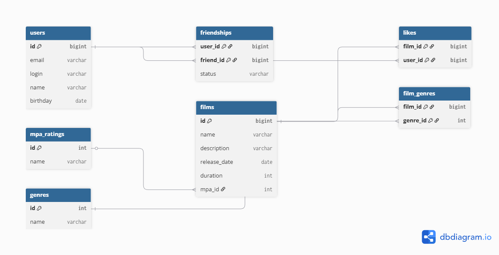

# java-filmorate
Template repository for Filmorate project.

## ER-диаграмма базы данных

## Описание схемы базы данных

База данных Filmorate состоит из следующих таблиц:

### users
Хранит информацию о пользователях.

Поля:
- id — идентификатор пользователя (PK)
- email — электронная почта
- login — логин пользователя
- name — имя
- birthday — дата рождения

### films
Хранит информацию о фильмах.

Поля:
- id — идентификатор фильма (PK)
- name — название
- description — описание
- release_date — дата выхода
- duration — продолжительность
- mpa_id — ссылка на рейтинг MPA (FK)

### mpa_ratings
Справочник возрастных рейтингов.

Поля:
- id — идентификатор рейтинга (PK)
- name — название рейтинга (G, PG, PG-13, R, NC-17)

### genres
Справочник жанров фильмов.

Поля:
- id — идентификатор жанра (PK)
- name — название жанра

### film_genres
Связующая таблица между фильмами и жанрами (many-to-many).

Поля:
- film_id — идентификатор фильма (FK)
- genre_id — идентификатор жанра (FK)

### likes
Хранит информацию о лайках пользователей фильмам.

Поля:
- film_id — идентификатор фильма (FK)
- user_id — идентификатор пользователя (FK)

### friendships
Хранит информацию о дружбе между пользователями.

Поля:
- user_id — пользователь, отправивший запрос
- friend_id — пользователь, получивший запрос
- status — статус дружбы (UNCONFIRMED / CONFIRMED)

## Примеры основных запросов

### Получить всех пользователей
SELECT * 
FROM users;

### Получить все фильмы
SELECT *  
FROM films;

### Получить фильм с его жанрами
SELECT f.name, g.name 
FROM films f 
JOIN film_genres fg ON f.id = fg.film_id 
JOIN genres g ON fg.genre_id = g.id 
WHERE f.id = 1;

### Получить топ 10 популярных фильмов
SELECT f.*, COUNT(l.user_id) AS likes_count 
FROM films f 
LEFT JOIN likes l ON f.id = l.film_id 
GROUP BY f.id 
ORDER BY likes_count DESC 
LIMIT 10;

### Получить друзей пользователя
SELECT u.* 
FROM users u 
JOIN friendships f ON u.id = f.friend_id 
WHERE f.user_id = 1 
AND f.status = 'CONFIRMED';